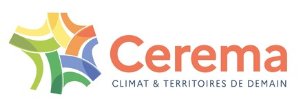

I am a researcher at [Cerema](https://www.cerema.fr/en) (Centre d'Études et d'Expertise sur
les Risques, l'Environnement, la Mobilité et l'Aménagement), affiliated with the
[UMR MCD](https://mcd.univ-gustave-eiffel.fr/) (Unité Mixte de Recherche Matériaux et
Durabilité des Constructions, Université Gustave Eiffel).

My work lies at the intersection of theoretical mechanics, materials science and scientific
computing. It combines the analytical development of micromechanical models with their
implementation in open-source libraries, and their application to civil engineering
materials — concrete and cement pastes, bituminous mixes, rocks and fractured media.

::: {.affil-strip}
[{.affil-logo fig-alt="Cerema"}](https://www.cerema.fr/en)
[{.affil-logo}](https://mcd.univ-gustave-eiffel.fr/)
:::

## Research interests

- **Micromechanics and homogenization** — analytical and semi-analytical methods for
  predicting effective properties of heterogeneous materials (composites, geomaterials,
  cracked media)
- **Eshelby-based models** — dilute, Mori–Tanaka, self-consistent and generalized
  self-consistent schemes for ellipsoidal and crack-like inclusions
- **Nonlinear and viscoelastic behavior** — extension of homogenization methods to
  nonlinear elasticity and linear viscoelasticity
- **Scientific software development** — open-source libraries in Julia and C++ for
  computational micromechanics (see [Software](software.qmd))

## Background

PhD in 2005 from the École Nationale des Ponts et Chaussées,
*[Approche micromécanique de la rupture et de la fissuration dans les géomatériaux](https://pastel.hal.science/pastel-00001296v1/)*
(a micromechanical approach to failure and cracking in geomaterials).

## Publications and code

The [Publications](publications.qmd) page lists every reference — journal articles,
conference papers, reports, patents and software releases — on a single filterable
timeline. Author-accepted manuscripts of the journal articles are self-archived, in HTML and
PDF, on the [Postprints](postprints.qmd) page.

<!-- ## CV

A full curriculum vitae is available for download: [CV (PDF)](files/cvjfb_en.pdf). -->

## Contact

[jf.barthelemy@cerema.fr](mailto:jf.barthelemy@cerema.fr)
