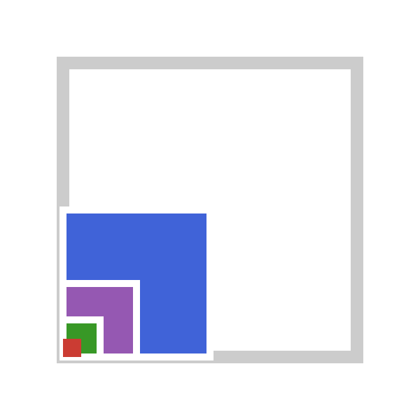

{.jfb-page-logo}

**DECUHR.jl** is a pure-Julia port of the DECUHR algorithm of Espelid & Genz (1994) for the
automatic adaptive integration of functions with vertex singularities over hyper-rectangles —
the situation met when integrating Green functions over an inclusion.

### Key features

- **Vertex-singularity handling** by extrapolation, where a plain adaptive rule stalls
- **Hyper-rectangular domains** in arbitrary dimension
- **SciML integration** — exposed as a pluggable algorithm for
  [Integrals.jl](https://docs.sciml.ai/Integrals/stable/)

### Links

