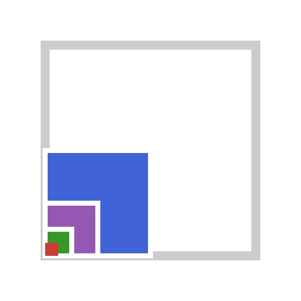

{.jfb-page-logo}

**DECUHR.jl** is a pure-Julia port of the DECUHR algorithm of Espelid & Genz for the
automatic adaptive integration of functions with vertex singularities over hyper-rectangular
regions — the situation met whenever a Green function is integrated over an inclusion. Where a
plain adaptive rule keeps subdividing without ever converging, the algorithm couples the
subdivision to an extrapolation that removes the singular contribution.
Part of the **[MicroPoroChemoMechanics](mpcm.qmd)** ecosystem.

### Key features

- **Vertex singularities** — subdivision coupled to an extrapolation in the cell size, which is
  what removes the singular contribution instead of chasing it; logarithmic singularities too
- **Hyper-rectangular regions** — boxes of dimension 2 to 15, with rules of degree 13 and 11
  dedicated to 2D and 3D
- **Strength known or not** — the algebraic exponent can be supplied when the analysis gives it,
  or estimated from the samples when it does not
- **Vector-valued integrands** — a whole tensor of integrals shares one subdivision history
  rather than being recomputed component by component
- **A SciML algorithm** — `DecuhrAlgorithm` plugs into
  [Integrals.jl](https://docs.sciml.ai/Integrals/stable/) like any other solver, and
  `ForwardDiff` passes through it, estimated exponent included

### Installation

DECUHR.jl is registered in Julia's General registry:

```julia
using Pkg
Pkg.add("DECUHR")
```

### Credits and license

The algorithm and the original Fortran 77 routines are due to T. O. Espelid and A. Genz,
*DECUHR: an algorithm for automatic integration of singular functions over a hyperrectangular
region*, Numerical Algorithms **8** (1994) 201–220,
[doi:10.1007/BF02142691](https://doi.org/10.1007/BF02142691). This package is an independent
Julia port of that work, under the MIT license, shipping the upstream copyright notice
unmodified.

### Links

[](https://MicroPoroChemoMechanics.github.io/DECUHR.jl/)
[](https://github.com/MicroPoroChemoMechanics/DECUHR.jl)
[](https://doi.org/10.5281/zenodo.22878393)
