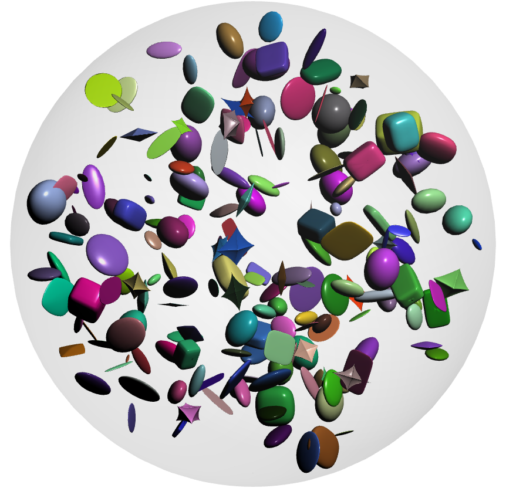

{.jfb-page-logo}

**echoes** (Extended Calculator of HOmogEnization Schemes) implements a wide range of
analytical homogenization models for random heterogeneous media.

### Key features

- Dilute, Mori–Tanaka, self-consistent, and generalized self-consistent schemes
- Ellipsoidal and crack-like heterogeneities
- Elasticity, thermal conductivity, and linear viscoelasticity
- Derivatives of effective properties with respect to phase parameters
  (essential for secant-based nonlinear homogenization)
- Python interface with supporting modules

### Documentation

Full documentation and examples are available at
[echoes.barthelemy.xyz](https://echoes.barthelemy.xyz/).

### Links

