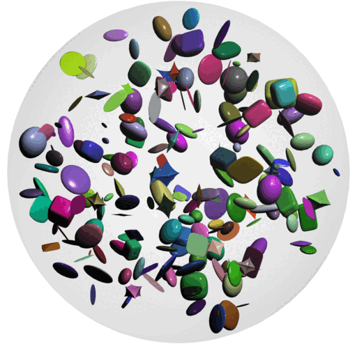

{.jfb-page-logo}

**echoes** (Extended Calculator of HOmogEnization Schemes) estimates the effective properties
of a random heterogeneous medium from the properties, shapes and volume fractions of its
phases. It solves the Eshelby problem at second order (conductivity) and fourth order
(elasticity), for isotropic or anisotropic reference media, and feeds the result to a wide
family of mean-field schemes. Beyond the effective moduli themselves, it returns their
derivatives with respect to the lower-scale moduli — the ingredient a secant-based nonlinear
homogenization needs. The numerical core is C++; the modeling is written in Python.

### Key features

- **A wide family of schemes** — bounds, dilute and its dual, Mori–Tanaka, self-consistent and
  asymmetric self-consistent, Maxwell, Ponte Castañeda–Willis, differential
- **Eshelby at both orders** — second order for conductivity, fourth order for elasticity;
  isotropic and anisotropic media; ellipsoids, cracks, `n`-layer spheres, generic inclusions
- **Time and frequency** — aging linear viscoelasticity and complex moduli, so a creep or a
  dynamic modulus follows from the same microstructure
- **Derivatives of the moduli** — the sensitivity of the macroscopic stiffness to the
  lower-scale moduli, which is what makes secant-based nonlinear homogenization possible
- **C++ core, Python interface** — the numerics are compiled; the modeling is scripted next to
  NumPy and Matplotlib, in a notebook or a plain script

### Installation

Binary wheels for Windows and Linux, Python 3.7 to 3.12, are attached to the Zenodo record the
DOI below resolves to — pick the file matching your interpreter, then `pip install` it.

### Documentation

The documentation is a course — tensor calculus, Eshelby and Hill tensors, concentration,
schemes, viscoelasticity, nonlinear homogenization — with every tutorial runnable, at
[jfbarthelemy.github.io/echoes](https://jfbarthelemy.github.io/echoes/).

### License

The wheels are distributed under the ECHOES Academic and Research License: free use for
non-commercial research, academic and teaching purposes; any commercial use requires a separate
written agreement with the copyright holder. The manual is licensed CC BY-SA 4.0.

### Links

