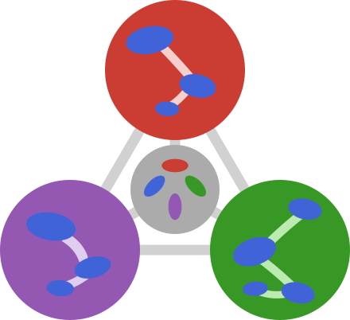

{.jfb-page-logo}

**MicroPoroChemoMechanics** is a collection of Julia packages for multiscale modelling
of porous reactive materials — from molecular-level thermodynamic equilibrium to
macroscopic poromechanical response. Every package is `ForwardDiff`-compatible,
dimensionally aware via `DynamicQuantities`, and designed to compose cleanly with the
SciML ecosystem.

All packages are registered in the dedicated [MPCM-Registry](https://codeberg.org/MicroPoroChemoMechanics/MPCM-Registry)
and hosted on [Codeberg](https://codeberg.org/MicroPoroChemoMechanics).

---

## Core packages

See individual package pages: [TensND.jl](tensnd.qmd) and [ChemistryLab.jl](chemistrylab.qmd).

---

## In development

### MeanFieldHom.jl

{.jfb-page-logo}

**Mean-field homogenisation framework** for heterogeneous materials.
Hill polarisation tensors for ellipsoidal inclusions and infinite cylinders,
crack-opening-displacement tensors with stress and displacement intensity factors,
second-order Hill tensors for transport problems, and layered-sphere composite models.

Currently in active development with full type-generic support (Float64, Complex, Dual, SymPy).

---

## Backend packages

### OptimaSolver.jl

**Primal-dual interior-point solver** for Gibbs-energy minimization with diagonal Hessian
structure and implicit-differentiation sensitivity matrices. Serves as a core solver backend
for ChemistryLab.jl equilibrium computations.

### DECUHR.jl

**Pure-Julia port** of the DECUHR algorithm (Espelid & Genz, 1994) for automatic
adaptive integration of functions with vertex singularities over hyper-rectangles.
Exposed as a pluggable algorithm for the SciML **Integrals.jl** ecosystem.

---

[ Organization on Codeberg](https://codeberg.org/MicroPoroChemoMechanics){.jfb-btn .jfb-btn-primary}
