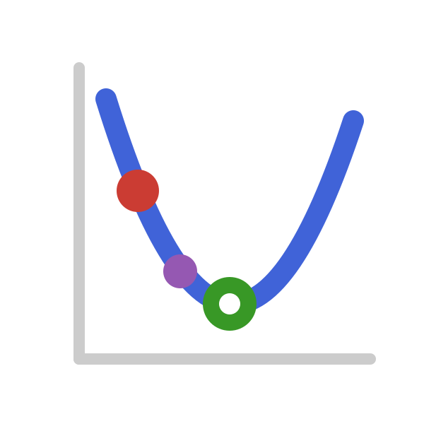

{.jfb-page-logo}

**OptimaSolver.jl** is a primal-dual interior-point solver written for the specific shape of
chemical equilibrium problems: minimization of a Gibbs energy whose Hessian is diagonal, under
linear mass-balance constraints. It serves as a core solver backend for
[ChemistryLab.jl](chemistrylab.qmd) equilibrium computations.

### Key features

- **Primal-dual interior-point method** exploiting the diagonal Hessian structure of an ideal
  or non-ideal Gibbs energy
- **Sensitivity matrices** obtained by implicit differentiation of the optimality conditions,
  so derivatives of the equilibrium state come out of the solve itself
- **Warm start** from a previous solution, for continuation along a reaction path

### Links

