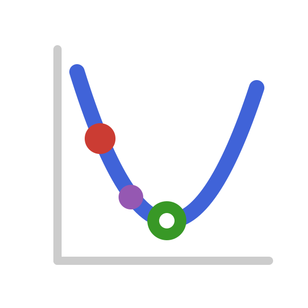

{.jfb-page-logo}

**OptimaSolver.jl** minimizes a Gibbs energy under linear mass-balance constraints, the
problem every chemical equilibrium reduces to. It provides a log-barrier interior-point method,
an independent Julia port of the **Optima** C++ library of
[Allan Leal](https://erdw.ethz.ch/en/people/profile.allan-leal.html) (ETH Zürich), and a Newton
method on the optimality conditions in the space of the Lagrange multipliers, which
[ChemistryLab.jl](chemistrylab.qmd) calls by default. Whichever method produced it, an answer
is checked by a KKT certificate, and `ForwardDiff` derivatives pass through the solve to any
order.
Part of the **[MicroPoroChemoMechanics](mpcm.qmd)** ecosystem.

### Key features

- **A certificate, not a stopping test** — `kkt_certificate` checks the optimality conditions
  at any point, whatever produced it; for a convex problem they are sufficient, so it proves the
  global minimum
- **Two methods, one problem** — the interior point takes its Newton step through a Schur
  complement of the diagonal Hessian; the multiplier-space Newton holds bounded species in an
  active set
- **A start from a linear program** — `lp_start` solves the pure-phase program by a verified
  simplex; an impossible budget comes back with its Farkas proof rather than as a failed
  iteration
- **Every row at its own scale** — each mass balance is judged against what it holds, so a
  trace nine orders of magnitude below the major elements is kept to its own amount
- **Exact derivatives** — dual numbers in the budget, the data or the parameters return the
  derivatives of the solution by the implicit-function theorem, nested to any order
- **Solvents and their solutes** — a phase given `invert` recovers its solutes in one call,
  through one equation in the ionic strength for activity models of the Debye–Hückel family

### Installation

OptimaSolver.jl is registered in Julia's General registry:

```julia
using Pkg
Pkg.add("OptimaSolver")
```

### Credits and license

The interior-point method is an independent port of Optima
([github.com/reaktoro/optima](https://github.com/reaktoro/optima), © 2020–2024 Allan Leal),
not affiliated with its authors; the Julia port is © 2026 Jean-François Barthélémy, under
LGPL-2.1-or-later. Its design — Schur-complement Newton step, filter line search, variable
stability classification, implicit-differentiation sensitivity — comes from that library and
from Leal, Blunt & LaForce (2014), *Efficient chemical equilibrium calculations for
geochemical speciation and reactive transport modelling*, Geochimica et Cosmochimica Acta
**131**, 301–322, [doi:10.1016/j.gca.2014.01.038](https://doi.org/10.1016/j.gca.2014.01.038).

### Links

[](https://MicroPoroChemoMechanics.github.io/OptimaSolver.jl/)
[](https://github.com/MicroPoroChemoMechanics/OptimaSolver.jl)
[](https://doi.org/10.5281/zenodo.19534031)
