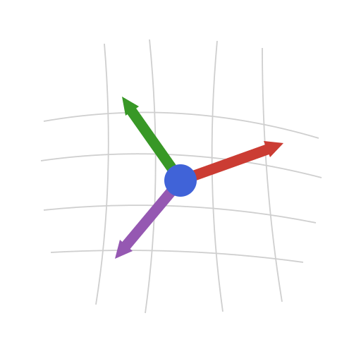

{.jfb-page-logo}

**TensND.jl** provides structured tensor types for multi-linear algebra with built-in
symmetries and automatic index conventions (base-1), fully compatible with automatic
differentiation via ForwardDiff.

### Key features

- **Isotropic tensors** (`TensISO`) — fully symmetric with minimal storage
- **Walpole basis** (`TensWalpole`) — standard orthonormal basis for symmetric 4th-order tensors
- **Orthotropic tensors** (`TensOrtho`) — material symmetry classes
- **General tensors** — flexible indexed storage
- **ForwardDiff-compatible** — all operations support dual numbers for AD
- **Base-1 indexing** — natural tensor index convention (e₁, e₂, …)

### Installation

```julia
using Pkg
Pkg.Registry.add(RegistrySpec(url="https://codeberg.org/MicroPoroChemoMechanics/MPCM-Registry"))
Pkg.add("TensND")
```

### Links

[](https://MicroPoroChemoMechanics.codeberg.page/TensND.jl/)
[](https://codeberg.org/MicroPoroChemoMechanics/TensND.jl)
