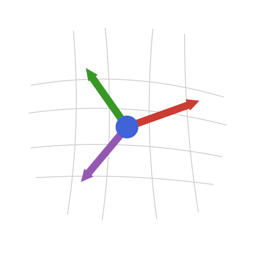

{.jfb-page-logo}

**TensND.jl** performs tensor calculations of any order and dimension in arbitrary coordinate
systems (cartesian, polar, cylindrical, spherical, spheroidal or user-defined). It supports
both symbolic computation (SymPy.jl, Symbolics.jl) and numerical evaluation with automatic
differentiation (ForwardDiff.jl). The implementation is inspired by the Maple library
[Tens3d](http://jean.garrigues.perso.centrale-marseille.fr/tens3d.html) by Jean Garrigues.
Part of the **[MicroPoroChemoMechanics](mpcm.qmd)** ecosystem.

### Key features

- **Basis types** — canonical, rotated, orthogonal, and fully general (non-orthogonal, symbolic)
- **Tensor algebra** — products (`⊗`, `⊗ˢ`, `⊠`, `⊠ˢ`, `⋅`, `⊡`, `⊙`), change of basis, variance management
- **Structured tensors** — isotropic (`TensISO`), transversely isotropic (`TensTI{4}`, `TensTI`)
  and orthotropic (`TensOrtho`), with compact storage and efficient algebra
- **Symmetry projection** — closest ISO, TI or ORTHO tensor, with rotation optimised via NLopt.jl
- **Differential operators** — gradient, symmetric gradient, divergence, Laplacian and Hessian
  in curvilinear coordinates, symbolically or numerically
- **Generic type system** — `Float64`, symbolic types (`Sym`, `Num`) and `ForwardDiff.Dual`

### Installation

TensND.jl is registered in Julia's General registry:

```julia
using Pkg
Pkg.add("TensND")
```

### Links

[](https://MicroPoroChemoMechanics.github.io/TensND.jl/stable/)
[](https://github.com/MicroPoroChemoMechanics/TensND.jl)
[](https://doi.org/10.5281/zenodo.17985768)
