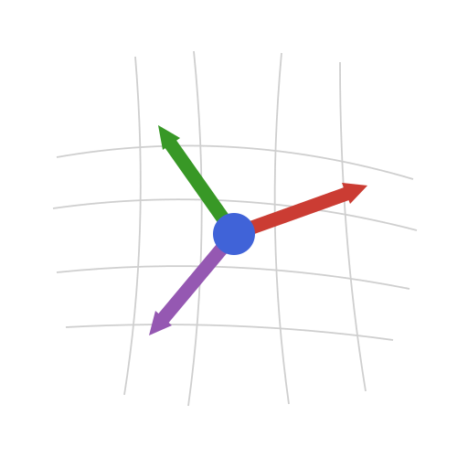

{.jfb-page-logo}

**TensND.jl** performs tensor calculations of any order and dimension in arbitrary coordinate
systems (cartesian, polar, cylindrical, spherical, spheroidal or user-defined). It supports
both symbolic computation (SymPy.jl, Symbolics.jl) and numerical evaluation with automatic
differentiation (ForwardDiff.jl). The implementation is inspired by the Maple library
[Tens3d](http://jean.garrigues.perso.centrale-marseille.fr/tens3d.html) by Jean Garrigues.
Part of the **[MicroPoroChemoMechanics](mpcm.qmd)** ecosystem.

### Key features

- **Basis types** — canonical, rotated, orthogonal, and fully general (non-orthogonal, symbolic)
- **Tensor algebra** — products (`⊗`, `⊗ˢ`, `⊠`, `⊠ˢ`, `⋅`, `⊡`, `⊙`), change of basis, variance management
- **Structured tensors** — isotropic (`TensISO`), transversely isotropic (`TensTI`), orthotropic
  (`TensOrtho`) and cubic (`TensCubic`), storing 2 to 9 coefficients instead of 81 and staying in
  their class through products and inversion
- **Symmetry projection** — closest isotropic, transversely isotropic, orthotropic or cubic
  tensor, with the material frame given or recovered by rotation optimization (NLopt.jl)
- **Differential operators** — gradient, symmetric gradient, divergence, Laplacian and Hessian
  in curvilinear coordinates, symbolically or numerically
- **Generic type system** — the same code path runs on `Float64`, on symbolic scalars (`Sym`,
  `Num`) and on `ForwardDiff.Dual`, so sensitivities come for free

### Installation

TensND.jl is registered in Julia's General registry:

```julia
using Pkg
Pkg.add("TensND")
```

### Links

[](https://MicroPoroChemoMechanics.github.io/TensND.jl/stable/)
[](https://github.com/MicroPoroChemoMechanics/TensND.jl)
[](https://doi.org/10.5281/zenodo.17985768)
